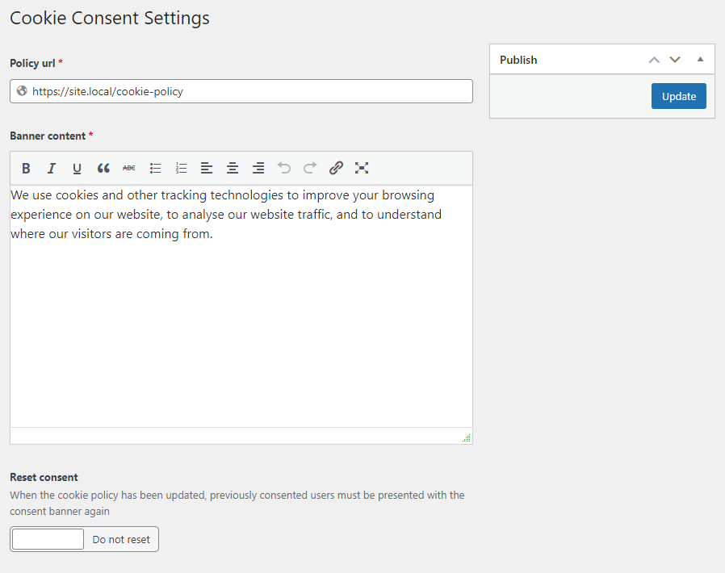
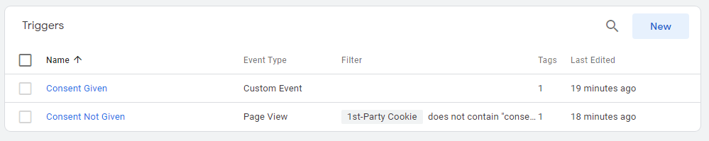
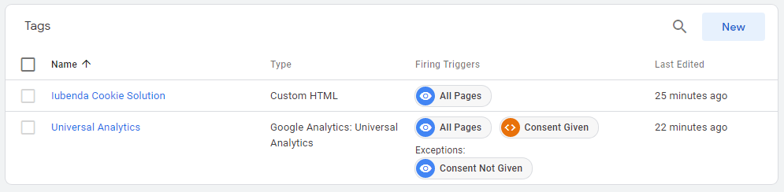

When a site requires analytics (e.g. Google Analytics), we must make sure it only runs when and after the user gives consent (e.g. via Iubenda's accept cookies prompt).

[[_TOC_]]

# Initial Setup
Firstly, we need to get/setup the relevant accounts:
- Google Tag Manager (to control when things fire)
- Google Analytics (to track analytics for the site)
- A consent solution (e.g. Iubenda's "cookie solution") (to inform GTM when a user has consented for analytics, and anything else)

_There's a possibility that the client already has some of the above, and/or isn't using Iubenda. If that's the case, we have a fall-back solution for the consent interaction, and the client will have to rely on manual content for the legal pages now that Iubenda won't be generating it for them (privacy and cookie policy)._

## What you'll need
### Essentials
- Google Tag Manager
   - Container ID (i.e. `GTM-XXXXXXX`)
   - Account access
- Google Analytics
   - ID, either:
      - Universal Analytics tracking ID (i.e. `UA-XXXXXXXXXX-X`) 
      - GA4 measurement ID (i.e. `G-XXXXXXXXXXX`)

### Iubenda
- Cookie policy ID (i.e. `XXXXXXXX`) (retrieve it by going to the cookie solution embed code on Iubenda and getting the number out from the url following the format `https://www.iubenda.com/privacy-policy/XXXXXXXX/cookie-policy`)

# Consent
First we need to provide the user with a way to opt-in to the site's privacy and cookie policies.

## Iubenda
Login to Iubenda, and setup the "cookie solution". 
When configuring the widget, you'll need to go to the "Advanced View".
Under "Callbacks > On consent given", enter exactly the following script:

`function() { window.dataLayer = window.dataLayer || []; window.dataLayer.push({'event': 'cookie_consent_given'}) }`

Then save your changes, make a note of the cookie policy ID in the embed code, and copy the whole "Embed the banner" code to your clipboard, you'll need it later.

## Not Iubenda
1. Enable the `CookieConsent` MWB plugin within your theme
2. Enter the policy url within the MWB plugin's settings (Settings > Cookie Consent) (see below)

# Google Tag Manager
Next we need to setup the triggers and tags for all the external services to run when they're supposed to.

## Triggers
Create two triggers with the following names.
### 1. "Consent Given" trigger
1. Name: "Consent Given"
1. Trigger type: Custom Event
1. Event name: `cookie_consent_given`
1. This trigger fires on: "All Custom Events"
1. Hit "Save"

### 2. "Consent Not Given" trigger (if using Iubenda)
1. Name: "Consent Not Given"
1. Trigger type: Page View
1. This trigger fires on: "Some Page Views"
1. Select New variable
1. Variable name: "Cookie - Iubenda"
1. Variable type: 1st-Party Cookie
1. Retrieve your iubenda cookie policy ID from the cookie solution embed code on iubenda and selecting the number from the `https://www.iubenda.com/privacy-policy/XXXXXXXX/cookie-policy` url
1. Cookie name: `_iub_cs-XXXXXXXX` with your cookie policy id replacing the Xs
1. Hit "Save"
1. Cookie - Iubenda > does not contain > `"consent":true`
1. Hit "Save"

### Screenshot

## Tags
Create two tags with the following names.
### 1. "Universal Analytics" tag
1. Name: "Universal Analytics"
1. Tag type: "Google Analytics: Universal Analytics"
1. Track type: "Pageview"
1. Google Analytics settings: Select "new variable...", call is "Google Analytics settings" and enter your analytics ID in the "Tracking ID" field
1. Two Firing triggers: "All Pages" & "Consent Given"
1. One Exception trigger: "Consent Not Given"
2. Hit "Save"

### 2. "Iubenda Cookie Solution" tag (if using Iubenda)
1. Name: "Iubenda Cookie Solution"
1. Tag type: "Custom HTML"
1. Paste the Iubenda Cookie Solution "Embed the banner" code into the HTML field
1. One Firing trigger: "All Pages"
2. Hit "Save"

### Screenshot

## Complete setup
Publish your changes

# Finishing up
## To initialise Google Tag Manager
Ensure the "[Analytics](/Plugins/Analytics)" MWB plugin is enabled, and [follow it's instructions](/Plugins/Analytics).

## To render Iubenda's policy pages (if using Iubenda)
Ensure the "[Iubenda](/Plugins/Iubenda)" MWB plugin is enabled, and [follow it's instructions](/Plugins/Iubenda).

# Testing
* Check the browser's console on the site for any errors
* Preview the your tag manager tag and reload your site. There should be a Tag Manager thing at the bottom of your screen telling you about any events and tags. Make sure no analytics are running before consent.
* Click accept on the cookie prompt and see if Tag Manager now correctly triggers analytics.